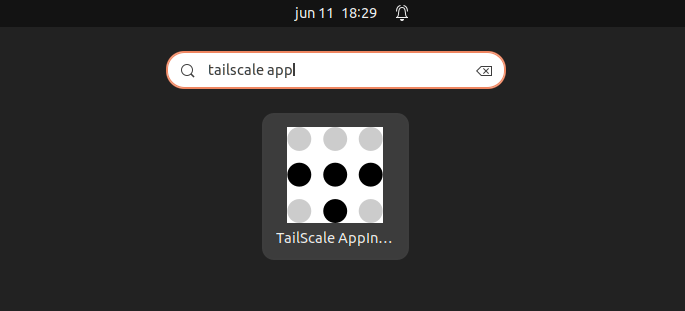

# Tailscale Appindicator

This is a simple Ubuntu Appindicator for Tailscale VPN and fit my needs.

**Disclaimers:** YES, there are other (and possibly better built) alternatives, 
however

 * I wanted to play around with Python and the making of an App Indicator
 * I would be uneasy working with a random person GH project and a VPN

## Features

The menu provides multiple actions to interact with the VPN Client


* Status: Shows the current connection status
* Auto-Reconnect: (Not currently Available), auto-reconnect to the VPN in case of disconnection
* Enable-Sudoers: Add the appropiate configuration to connnect/disconnect without being requested sudo password

### Color Coded

The tray icon changes colour depending on its status. Green is Connected, Red is Disconnected.


### Alerts
If it is enabled, when we are connected to the VPN we will receive an alert in case it is disconnected.
It will also alert us of the auto-connect status


## Installation

### Manual Installation

First install dependencies

```
sudo apt install gir1.2-ayatanaappindicator3-0.1
```
then proceed to install
```
sudo make -f Makefile.local local-install
```

### Releases
Go to the releases section and download the .deb

## Running

There are some alternatives to this
 
 - Via command line `tailscale-appindicator` and an attached session
 - Via the Applications tray
    
 - Systemctl `systemctl --user start tailscale-appindicator`

> [!IMPORTANT]
> The application only allowes one instance running at a time

You can add it to be started automatically via

```
systemctl --user enable tailscale-appindicator
```
